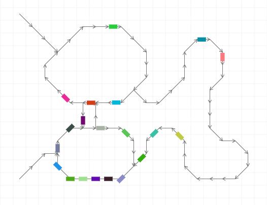

# Traffic

A traffic simulation.

The simulation is run on the server, with events being streamed to the client. This means that the same simulation can be viewed by multiple clients at the same time.

Uses [Clojure](http://clojure.org), [HTTP Kit](http://http-kit.org), [Backbone](http://backbonejs.org/), [KineticJS](http://kineticjs.com/).

## Usage

Install [leiningen](http://leiningen.org/).

    $ lein run

Point your browser to http://localhost:3000/static/index.html. Click and drag to draw/erase roads. Click on the roads to add vehicles.
